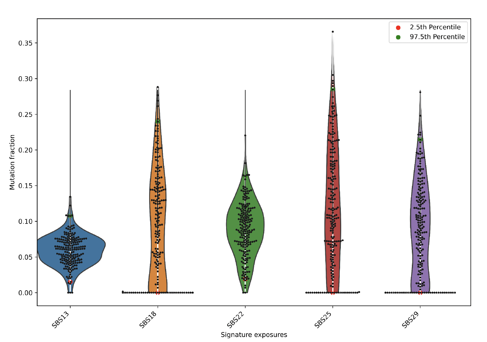

========
StarSign
========

Mutation signature analysis package
-----------------------------------

* Free software: MIT license
* Documentation: Link to be provided

Features
--------

Stable release
--------------

To install StarSign, run this command in your terminal::

    1. Download StarSign from https://github.com/uio-bmi/StarSign
    2. Unzip StarSign-master.zip
    3. cd StarSign-master/
    4. pip install -e .

Getting started
---------------

To obtain help::

    mutational_starsign --help

Usage: mutational_starsign [OPTIONS] COMMAND [ARGS]...

Commands::

    count-mutation  Count mutation types in a VCF file
    denovo          Parameters: matrix_file, n_signatures
    refit           Parameters: numeric_chromosomes, n_bootstraps

Running mutational signature refit algorithm:
---------------------------------------------

The refitting algorithm takes as input a mutational catalog and a COSMIC mutational signature file::

    mutational_starsign refit --help

Running StarSign refit::

    mutational_starsign refit example_data/skin20.txt example_data/sig_cosmic_v3_2019.txt --output-folder /test_result
    mutational_starsign refit example_data/tcga_coad_single.vcf example_data/sig_cosmic_v3_2019.txt --output-folder /test_result

The test data is provided in the example_data folder. To convert *.vcf to a matrix, the user must provide the path to the reference genome using the option --ref-genome.

Output files for a single sample (example of TCGA-BRCA)::

    StarSign_exposure_signature_single_sample: exposure matrix with 25th percentile error
    StarSign_Exposure_exposure_single_sample_25_percentile: exposure matrix plot

The confidence is computed using the 25th percentile of bootstraps.

Output files for a cohort (example of TCGA-SKIN)::

    exposures_cohort_variance: a plot showing the variance of each sample and the mean exposures
    output_file_exposure: a cohort exposures matrix
    exposures_cohort_top_5: a plot showing the top 5 exposures
    exposures_cohort_dotplot: a plot showing a dotplot of the exposure matrix

.. image:: output/exposures_cohort_variance.png
   :width: 600

.. image:: output/exposures_cohort_top_5.png
   :width: 600

The user can also provide the distribution of triplets in a reference genome/exome or normal tissue in the same patient (Opportunity matrix) using the option --opportunity-file human-genome/human-exome.

Running mutational signature de novo algorithm:
-----------------------------------------------

The de novo algorithm takes as input a mutational catalog and infers the exposure matrix and mutational signature matrix. The COSMIC mutational signature file is provided to compute the cosine similarity::

    mutational_starsign denovo --help

Step 1: Grid Search: The grid uses cross-validation to find the optimal pairwise (k and λ)::

    snakemake -j #processor

Step 2: In the Snakefile, provide the range of the number of signatures k and λ for the grid search to determine the optimal k and λ::

    localrules: all
    ks = list(range(2, 10)): default range of the number of signatures
    lambdas = [0, 0.01, 0.05, 0.1, 0.2]: default range of λ

Input mutational catalogue needs to be provided in the dataset folder::

    rule test_train_split:
        input: "results/{dataset}/pcawg_skin_21.txt"

Running the grid search::

    snakemake -j num_cpu

To check manually the optimal k and λ from the output::

    sort -k3n,3 results/data/all.csv

Run denovo using optimal k=4 and λ=0.1::

    mutational_starsign denovo snakemake/results/data/pcawg_skin_21.txt 4 0.1 --cosmic-file example_data/sig_cosmic_v3_2019.txt --output-folder /test_result

Output files::

    exposures_matrix
    mutational_signatures_matrix
    mutational_signatures_profile

.. image:: output/denovo_figure_k4.png
   :width: 600

Contact
-------

Maintainer Name - chrisbop@uio.no
