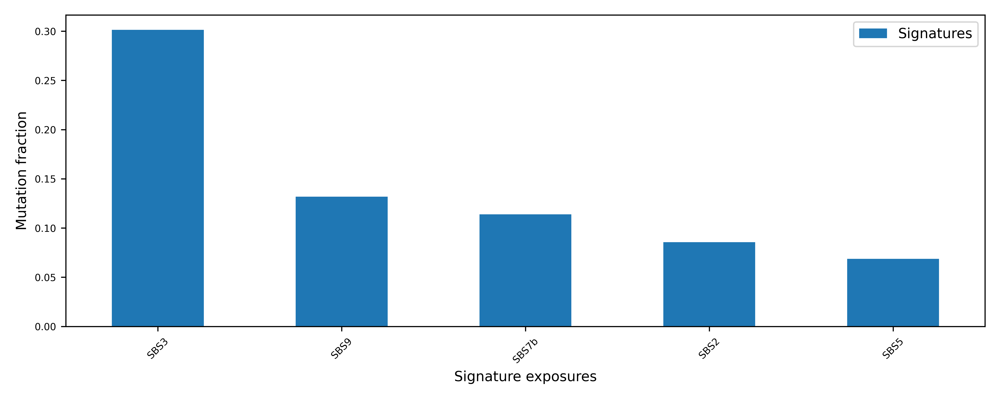
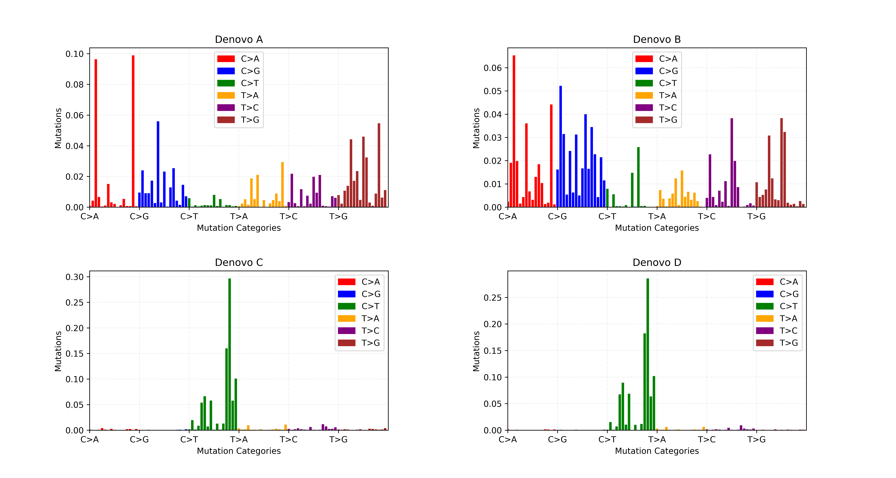

========
Cucumber
========

.. image:: https://img.shields.io/pypi/v/cucumber.svg
        :target: https://pypi.python.org/pypi/cucumber

.. image:: https://img.shields.io/travis/knutdrand/cucumber.svg
        :target: https://travis-ci.com/knutdrand/cucumber

Mutation signature analysis package
-----------------------------------

* Free software: MIT license
* Documentation: https://cucumber.github.com/cucumber/

Features
--------

Stable release
--------------

To install Cucumber, run this command in your terminal:

.. code-block:: console
    $ 1. download StarSign from https://github.com/uio-bmi/cucumber
    $ 2. unzip cucumber-master.zip
    $ 3. cd cucumber-master/

    $ 4. pip install -e .

Getting started
---------------
To obtain help :
::
   % cucumber --help
   $ Usage: cucumber [OPTIONS] COMMAND [ARGS]...
Commands:
::
  count-mutation ---Count mutation types in a VCF file
  denovo Parameters ---matrix_file: str n_signatures
  refit  Parameters ---numeric_chromosomes n_bootstraps

Running mutational signature refit algorithm:
-----------------------------------------------
The refitting algorithm takes as input a mutational catalog and cosmic mutational signature file
::
  %cucumber refit --help

Running cucumber refit
::
  %cucumber refit example_data/skin20.txt example_data/sig_cosmic_v3_2019.txt --output-folder /test_result
  %cucumber refit example_data/tcga_coad_single.vcf example_data/sig_cosmic_v3_2019.txt --output-folder /test_result

The test data is provided in example_data folder, to convert *.vcf to matrix, the user must provide the path to the reference genome using the option --ref-genome
output files for a single sample (example of TCGA-BRCA)
::
   $StarSign_exposure_signature_single_sample: exposure matrix with 25 percentile error
   $StarSign_Exposure_exposure_single_sample_25_percentile: exposure matrix plot

The standard deviation is computed using a default of 100 bootstraps.

.. image:: output/StarSign_Exposure_exposure_single_sample_25_percentile.png
   :width: 600

output files for a cohort (example of TCGA-SKIN)
::
   $exposures_cohort_variance: a plot showing the variance of each sample and the mean exposures
   $output_file_exposure: a cohort exposures matrix
   $exposures_cohort_top_5: a plot showing the top 5 exposures
   $ exposures_cohort_dotplot: a plot showing a dotplot of the exposure matrix

.. image:: output/exposures_cohort_variance.png
   :width: 600

The user can also provide the distribution of triplets in a reference genome/exome or normal tissue in the same patient (Opportunity matrix) using option
--opportunity-file human-genome/human-exome
Running mutational signature de novo algorithm:
-----------------------------------------------
The de novo algorithm takes as input a mutational catalog and inferred the exposure matrix and mutational signature matrix. The cosmic mutational signature file is provided to compute the cosine similarity.
::
  % cucumber denovo --help

Step 1: Grid Search: The grid uses cross-validation to find the optimal pairwise (k and $\lambda$)
::
  % Snakefile

Step 2: In the Sanakefile, provide the range of the number of signatures $k$ and $lambda$ for the grid search to determine the optimal k and lambda.
::
  %localrules: all
  %ks = list(range(2, 10)): default range of the number of signatures
  %lambdas = [0, 0.01,0.05, 0.1, 0.2]: default range of lambda

Input mutational catalogue needs to be provided in the dataset folder
::
  %rule test_train_split:
  % "results/{dataset}/pcawg_skin_21.txt"
Running the grid search
::
 % snakemake -j num_cpu
To check manually the optimal $k$ and $lambda$ from the output
::
 % sort -k3n,3 results/data/all.csv
Run denovo using optimal $k=4$ and $lambda=0.1$
::
 % cucumber denovo snakemake/results/data/pcawg_skin_21.txt 4 0.1 --cosmic-file example_data/sig_cosmic_v3_2019.txt --output-folder /test_result

output files
::
   $exposures_matrix
   $mutational signatures matrix
   $mutational signatures profile

Contact
-------

Maintainer Name - chrisbop@uio.no
